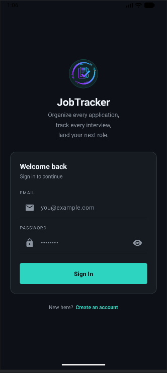

# JobTracker

A clean, minimal Android app to track job applications — built to learn real-world Firebase integration (Auth + Firestore) and the RecyclerView/Adapter pattern from scratch, without relying on tutorials or boilerplate templates.

## Features

- **Authentication** — Email/password sign up and login via Firebase Auth, with full input validation
- **Add Applications** — Log company, job title, salary, status, and date applied (with a native date picker)
- **Live Dashboard** — Real-time stats (Applied / Interviews / Replied) that update instantly as data changes, powered by Firestore snapshot listeners
- **Edit & Update** — Modify any existing application, with fields pre-filled from stored data
- **Delete with Confirmation** — Prevents accidental data loss with a confirmation dialog before deleting
- **Status Tracking** — Color-coded status tags (Applied / Interview / Rejected / Offer) for at-a-glance tracking
- **Change Password** — Secure password updates with re-authentication
- **Custom Dark UI** — Hand-built design system (not a default Material theme), consistent across every screen

## Screenshots

| Login | Register | Dashboard |
|---|---|---|
|  |  |  |

| Add Application | Edit Application | Profile |
|---|---|---|
|  |  |  |

## Tech Stack

- **Kotlin**
- **XML Views** with View Binding and Material Design components
- **Firebase Authentication** (email/password)
- **Cloud Firestore** — user-scoped subcollections (`users/{uid}/jobApplications`), with real-time listeners for live UI updates
- **RecyclerView + Adapter + ViewHolder** — built and understood from first principles, including callback-based click handling for edit/delete
- **Material Components** — `TextInputLayout`, `AutoCompleteTextView` for status dropdown, `MaterialButton`, `MaterialCardView`
- **DatePickerDialog** for native date selection

## Architecture Notes

- Firestore's `@DocumentId` annotation is used to cleanly map document IDs into the data model without storing them as redundant fields
- Adapter classes are kept free of business logic — actions (edit/delete) are passed in as lambda callbacks from the Activity, keeping the adapter reusable and easy to test
- Live data sync via `addSnapshotListener` means the dashboard reflects changes (add/edit/delete) instantly, without manual refresh logic

## Getting Started

To run this project locally:

1. Clone the repo and open it in Android Studio (minimum SDK 26, target/compile SDK 36–37)
2. Create your own Firebase project at [console.firebase.google.com](https://console.firebase.google.com)
3. Enable **Email/Password Authentication** and **Cloud Firestore** in your Firebase project
4. Download your own `google-services.json` and place it in the `app/` folder (the one in this repo is tied to the original developer's project and will not work for other users)
5. Build and run

## License

MIT — free to use, modify, and learn from.
